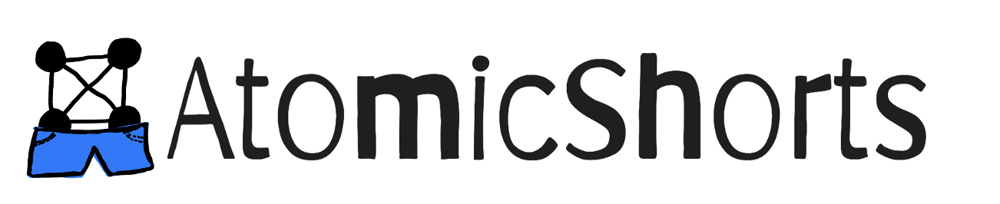
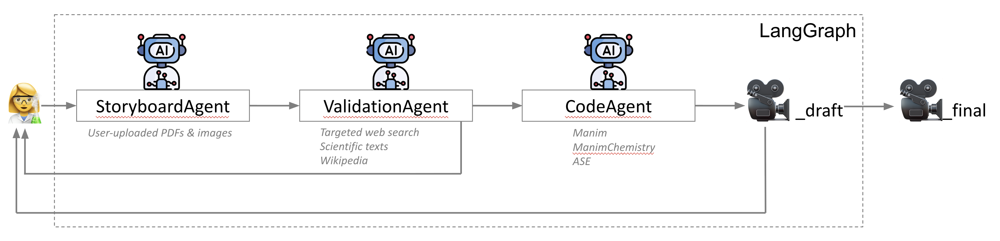

# atomic-shorts

AtomicShorts is a scientist-in-the-loop agentic workflow for prompt-to-video generation for materials science and chemistry. It aims to empower scientists to create short, narrated videos to convey their ideas across age groups and expertise levels. 

Our pipeline has three GPT-5 agents (StoryBoard, Validation, Code) that utilize materials science tools and are orchestrated via LangGraph, with the scientist-in-the-loop to iterate the script and video as needed. With this workflow, scientists can create simple, effective, and accurate narrated videos to accompany their recent papers and news articles, enabling them to communicate their science to fellow scientists and the general public. By involving scientists in the science communication pipeline, we hope to ensure accuracy of the scientific description, as well as increase public trust in science. 

# how to use
1. For the full prompt-to-video experience, visit this link - TBD
2. To see a demo of the workflow, visit this link - TBD
